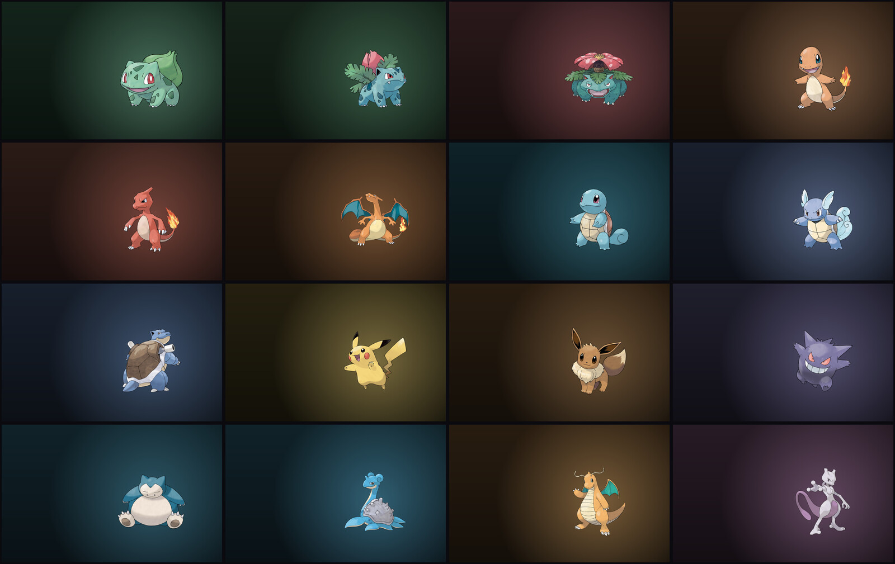

# Pokémon Theme

An [Omarchy](https://omarchy.org/) 4 theme that picks a different Pokémon every
day. Its **own artwork** sets the palette, the whole desktop retints to match, and
that artwork becomes the wallpaper. Every couple of weeks, it shows up shiny.



Companion to [omarchy-lock-pokemon](https://github.com/WSeubring/omarchy-lock-pokemon),
which does the same thing to the lock screen. The type colours and the
name-to-type table come from there, and if that plugin is installed the lock
screen shows the same Pokémon as the desktop — see [Lock screen](#lock-screen).

## What changes

Omarchy generates seventeen config files from a theme's `colors.toml`, so a
single generated palette carries all the way out to the edges:

| | |
| --- | --- |
| Terminals | alacritty, foot, kitty, ghostty |
| Editors | neovim, helix, vscode, obsidian |
| Shell & tools | the Omarchy bar, btop, gum, chromium |
| Agents | claude, pi |
| System | hyprland borders, keyboard backlight, icon theme |

`colors.toml` and the wallpaper are all this theme really writes; everything
above follows from them. It also emits `icons.theme` and, for the lock screen,
`shell.lock.toml`.

## Install

```bash
omarchy theme install https://github.com/WSeubring/omarchy-pokemon-theme
~/.config/omarchy/themes/pokemon/install.sh
```

The first command clones the theme into place and applies it. The second
schedules the daily roll and installs the hook. Requires `magick` (ImageMagick)
and `python3`, both already present on a stock Omarchy system.

To develop against a working copy instead, clone anywhere and run `install.sh`
from it — it links the checkout to `~/.config/omarchy/themes/pokemon`, so edits
take effect with no reinstall.

## Usage

```bash
bin/pokemon-theme-gen                      # generate today (no-op if current)
bin/pokemon-theme-gen --force              # roll it again now
bin/pokemon-theme-gen --date 2026-12-25    # what will Christmas look like
bin/pokemon-theme-gen --no-apply           # write the files, don't retint
```

The daily roll is a systemd user timer at 00:05 with `Persistent=true`, so a
laptop that was asleep across midnight catches up when it wakes. Switching to
the theme by hand (`omarchy theme set pokemon`, or the theme switcher) also
regenerates, so you never land on a stale day.

To stop it: `./uninstall.sh`.

## Picking a specific Pokémon

From the omarchy menu, under **Pokémon** — search all 905 by name, with the
active one ticked:

```
Pokémon…
   Pick for today     search all 905; reverts at midnight
   Random for today   surprise me; reverts at midnight
   Pin permanently    keep one until you unpin it
   Back to daily ✓    drop any pin and use the day's own Pokémon
```

**Back to daily** carries a ✓ when that is the current mode, so the menu shows
which of the three you are in without opening anything.

Those rows carry a `when` condition, so the whole section is hidden unless this
theme is the active one — a row whose `when` fails is hidden, and a submenu whose
rows are all hidden goes with it.

The picker pipes all 905 names into `omarchy-menu-select`, so the menu's own
fuzzy search *is* the autocomplete. That deliberately avoids writing 905 rows
into `omarchy-menu.jsonc`, and avoids needing a custom menu provider: the
provider table lives in the menu plugin's QML and cannot be extended from a
config file, so an unknown provider name is silently ignored.

The rows are spliced into `~/.config/omarchy/extensions/omarchy-menu.jsonc`
between sentinel comments and nothing outside them is touched, the same
convention `omarchy-gitlab-menu-sync` uses. Re-running is idempotent and
`--remove` restores the file byte for byte:

```bash
bin/pokemon-theme-menu-install            # add or refresh the rows
bin/pokemon-theme-menu-install --remove   # take them out again
```

Or from the command line:

```bash
bin/pokemon-theme-gen --pokemon gengar   # just for today
bin/pokemon-theme-gen --random           # a random one, just for today
bin/pokemon-theme-gen --hunt             # a random one, rolled for shiny
bin/pokemon-theme-gen --pin lapras       # permanently
bin/pokemon-theme-gen --unpin            # back to the daily roll
```

`--pokemon` holds for the rest of the day and then expires, so tomorrow rolls
normally. `--pin` writes `~/.config/omarchy-pokemon-theme/config.toml` and holds
until you unpin:

```toml
pokemon = "lapras"
```

That file is yours to edit by hand; an edit takes effect on the next run without
`--force`. It lives outside the theme directory deliberately — `omarchy theme
install` deletes and re-clones the theme, which would take a config inside it.

Four things decide the day, most specific first, and the generator prints which
one it used so the answer is never a mystery:

```
$ bin/pokemon-theme-gen
2026-08-18  #131 lapras (water/ice)  accent #6390f0  [pinned in config]
```

| Source | Lifetime |
| --- | --- |
| `--pokemon NAME` or `--random` | today, then expires |
| A pin set earlier today | today, then expires |
| `pokemon` in the config | until unpinned |
| The date's own roll | that day only |

The today-only pin is a file holding `<date> <name>`, consulted only while the
date still matches. Nothing expires it and nothing cleans it up — a stale one
simply stops applying, which is what you want on a laptop that was asleep at
midnight.

Pinning matters for more than novelty: the daily roll can hand you a Pokémon
whose palette you dislike, and unpinning is one command away.

## Shiny

Every day rolls for shiny at **1 in 14** — about once a fortnight. The unit here
is a day, not an encounter, so the canonical 1-in-4096 would mean about once a
decade: indistinguishable from never. A shiny day uses the shiny artwork, and
since the palette comes from the artwork, the whole desktop changes with it:
shiny Charizard themes the machine black-and-red instead of orange.

The roll is deterministic per day and name, so the timer, the boot catch-up and
the theme-set hook all agree about today. Pinning a Pokémon does not pin its
finish — a pin gets exactly the same odds a rolled day does.

Odds are configurable in `~/.config/omarchy-pokemon-theme/config.toml`:

```toml
shiny-odds = 14        # 1 in N for the daily roll; 4096 for canonical full odds
shiny-hunt-odds = 14   # 1 in N for the hunt, so you can change one and not the other
```

To go looking on purpose, hunt: one roll against one random Pokémon, per press.

```bash
bin/pokemon-theme-gen --hunt      # or the "Shiny hunt" row in the menu
```

A hunt that lands is remembered for the rest of the day, so the timer cannot
regenerate it away, and it notifies with the odds it just beat. `--shiny` forces
today's outright; `--no-shiny` forces it back.

## Lock screen

With [omarchy-lock-pokemon](https://github.com/WSeubring/omarchy-lock-pokemon)
installed, the lock screen shows the day's Pokémon instead of rolling its own,
so unlocking shows the one already on the desktop.

No change to the plugin is needed — it already supports pinning through
`lock.pokemon-name`, and the theme just names the day. Shiny rolls still happen,
so an unlock can still surprise you.

To go back to a random Pokémon on the lock screen, set it empty in
`~/.config/omarchy/shell.toml`:

```toml
[lock]
pokemon-name = ""
```

The machine-level file wins per key over anything a theme ships, so that one
line is enough. `bin/pokemon-theme-gen --no-lock-sync` stops the theme writing
the file at all.

The generated `shell.lock.toml` restates every `[lock]` colour token rather than
just the name, because `omarchy-theme-set-templates` replaces a section wholesale
instead of merging keys — a file with only `pokemon-name` in it would drop the
rest of the lock screen's palette. The two border tokens stay as literal
`hyprland.*` references so they keep tracking the Hyprland gradient.

## Ambient motion (optional)

Off by default. With it on, the day's types drive subtle motion behind the
wallpaper -- embers for a fire type, drifting flakes for an ice type, wisps for a
ghost -- reusing the eighteen effects from
[omarchy-lock-pokemon](https://github.com/WSeubring/omarchy-lock-pokemon).

```bash
./install.sh --with-animation
```

This part is **not a theme**, and cannot be: motion needs a Quickshell *plugin*,
which lives in `~/.config/omarchy/plugins/` rather than in a theme directory. So
the repo ships both halves. `omarchy theme install` alone gives the full static
theme and never touches the shell; the plugin is a deliberate second step.

The plugin is a clone of `omarchy.background` with an ambient layer added --
the wallpaper images, theme transition and reveal mask are upstream code
untouched. Installing it disables the stock renderer; `omarchy plugin enable
omarchy.background` hands the desktop back, and `./uninstall.sh` does that for
you.

Whether the plugin is installed *is* the on/off switch, so there is no extra
config file to drift: the theme writes `effects = "show"` when it finds an
ambient plugin and `"hide"` when it does not.

**It pauses rather than burning battery all day.** A lock screen animates for
five seconds; a desktop would animate for eight hours. So motion stops when the
focused workspace has any windows -- a wallpaper nobody can see is not worth
drawing -- and when the battery is discharging below 30%. Paused means the
`Loader`s deactivate and the shapes leave the scene graph, not that they animate
behind a zero opacity.

To keep the plugin but stop the motion, or to change any of it, override per key
in `~/.config/omarchy/shell.toml`:

```toml
[background]
effects            = "hide"   # motion off, plugin still installed
effect-intensity   = 1.0      # default is 0.55
pause-on-battery   = "never"
pause-when-covered = "false"
```

See [plugins/background/README.md](plugins/background/README.md) for every token
and the `debug` switch.

## How the palette is built

The hue comes from the **creature's own artwork**. The sprite is quantized to
eight colours and scored by coverage × chroma, so the winner is the largest
region that actually has a colour — Charizard's orange belly rather than fire
red, Lapras's specific blue, Umbreon's yellow rings rather than its black body.
A flat-grey Magnemite scores nothing worth having, and the clamps below carry it.

Type colours remain the fallback (no network, no artwork) and still own the
second border stop, which is a statement about category rather than pixels.
`--type-hue` opts a run back into the old type-only behaviour.

Whichever source wins, the Pokémon supplies **hue and nothing else**. Lightness and chroma come
from a fixed ladder measured off the stock Catppuccin and Tokyo Night themes,
whose neutral tokens all sit within about ten degrees of a single hue — that
unity is what reads as "a theme" rather than "some colours".

This split is the whole trick. Naively recolouring a theme from artwork gives
you a usable desktop on a Charizard day and an unreadable one on a Magnemite
day. Pinning the ladder and substituting only the hue means all 905 days are
structurally identical and differ only in colour.

Three places deliberately bend that rule:

- **The accent keeps its own lightness**, clamped to `[0.66, 0.865]`. Pinning it
  outright turned every yellow into mustard: hue 95 does not read as "electric"
  below L 0.85, while a violet up there is washed out. Inside the band the
  canonical type colour usually passes through untouched — electric really is
  `#f7d02c`.
- **ANSI colours rotate 15% toward the day's hue**, so the palette feels
  cohesive, but no further. Red has to still look red in a diff.
- **A second type tints the mid-greys** and pulls whichever ANSI anchors are
  closer to it, so a dual type shows up in the UI chrome without fighting the
  primary accent.

Everything happens in [OKLCh](https://bottosson.github.io/posts/oklab/), where
lightness is perceptually uniform, so "pin L" actually means "keep the same
apparent brightness" instead of "keep the same number".

### Dual types

Both types are used, in three places, and a dual type is meant to be noticeable
without being busy:

Just under half the 905 are dual-type (449), so this is the common case rather
than an edge case.

| | Primary type | Second type |
| --- | --- | --- |
| Borders | first gradient stop | second stop, at 45° |
| Palette | accent, backgrounds, foregrounds | mid-greys (`lighter_background`, `selection`, `muted`) |
| ANSI | anchors nearer the primary hue | anchors nearer its own hue |
| Ambient motion | front layer, full intensity | layer behind it, half intensity, own tint |

The borders are the most visible of these, and the same treatment
omarchy-lock-pokemon gives its card. A dual type sets `hyprland_active_border`
in `colors.toml` to a two-stop gradient, which omarchy resolves into *both*
`hyprland.lua` and `shell.toml`'s `hyprland.active-border` — so one line reaches
window borders, notifications, popups, menus and the lock card together:

```toml
hyprland_active_border = "rgba(9f82c6ee) rgba(c867c5ee) 45deg"
```

Both stops go through the same readable-band clamp as the accent, because
several type colours (dark, ghost, steel) are too dim at their native lightness
to read as a border against the palette's own background.

So a Gengar day is a violet desktop, magenta-tinted chrome, borders running
violet to magenta, and wisps drifting in front of creeping smog. A single-type
day emits one stop, giving a solid border, and everything falls back to the
primary hue.

## Tests

The generator will happily produce an unreadable theme if the maths is wrong on
one of 905 inputs, and you would not find out until that day came around. So
each property is checked across the whole set rather than spot-checked:

```bash
tests/run                            # all of them; --quick skips the slow sprite check

python3 tests/validate_contrast.py   # all 905 palettes vs WCAG, and hue drift
python3 tests/validate_schedule.py   # stability, spread, no near repeats
python3 tests/validate_sprites.py    # every name resolves to a sprite
python3 tests/validate_pins.py       # pin precedence and expiry
python3 tests/validate_shiny.py      # odds, determinism, config
python3 tests/validate_render.py     # wallpaper format, no stray temp files
python3 tests/validate_menu.py       # menu splice, idempotency, removal
```

`validate_contrast.py` runs two passes: the 905 type-based palettes, and a sweep
of every hue at four extremes of lightness and chroma. The second pass is the one
that matters now — the accent comes from an arbitrary sprite pixel, so the claim
worth testing is that the clamps hold for *any* input colour, not just for
eighteen type colours. Worst case across both is 4.93:1.

`validate_shiny.py` checks the odds are the odds (400k draws at 1-in-14, 1-in-64
and 1-in-4096), that a day's roll is deterministic, and that the config keys reach
the roll. That last one caught a real bug: `set_key` quoted everything it wrote,
so `shiny-odds = "4096"` came back a string and was silently ignored.

`validate_menu.py` earns its keep for a different reason: `omarchy-menu.jsonc` is
shared with every other tool that adds rows, so one bad character does not break
four rows, it breaks the file — and with it every other tool's entries. It also
checks that no `when` or `checked` condition contains a double quote, which is
the specific mistake that caused exactly that.

## Layout

| Path | Contents |
| --- | --- |
| `bin/pokemon-theme-gen` | The generator, and the only entry point |
| `lib/oklch.py` | sRGB ↔ OKLCh, with gamut mapping by chroma reduction |
| `lib/palette.py` | The ladder, the ANSI anchors, and `colors.toml` output |
| `lib/schedule.py` | Date → Pokémon, deterministic and stateless |
| `lib/pins.py` | Precedence between the roll and the two kinds of pin |
| `lib/config.py` | The user config file, read and edited in place |
| `lib/lockscreen.py` | The `shell.lock.toml` that pins the lock screen |
| `lib/ambient.py` | The `shell.background.toml` that drives the motion |
| `lib/wallpaper.py` | ImageMagick composition |
| `lib/artwork.py` | The creature's dominant colour, quantized and cached |
| `lib/atomic.py` | Replace-by-rename, and the two temp-name traps |
| `lib/shiny.py` | The odds, the daily roll and the hunt |
| `lib/state.py` | What is written out now: day, Pokémon, and why |
| `lib/xdg.py` | The config, state and cache directories |
| `lib/tomlout.py` | Shared rendering for the generated TOML sections |
| `data/dex.json` | National dex order, so a name gives an artwork id offline |
| `data/types.json` | Name → types, from PokéAPI via omarchy-lock-pokemon |
| `data/type-colors.json` | The eighteen community type colours |
| `data/type-effects.json` | Type → ambient effect name and traits |
| `plugins/background/` | The optional ambient background plugin |
| `systemd/` | The daily timer and its service |
| `hooks/theme-set` | Regenerates when you switch to this theme |
| `bin/pokemon-theme-pick` | The native menu picker over all 905 |
| `bin/pokemon-theme-menu-install` | Splices the menu rows in and out |
| `tests/validate_render.py` | The wallpaper output and scratch-name contract |
| `tests/run` | Runs every validator, reporting all failures |

`colors.toml`, `icons.theme`, `shell.lock.toml` and `backgrounds/today.jpg` are
generated. The wallpaper and the lock file are gitignored — a missing lock file
only means the lock screen rolls its own Pokémon. `colors.toml` and
`icons.theme` are committed, since a theme without `colors.toml` generates no
configs at all, and a fresh clone should apply cleanly before the first run.

## Notes

Shiny artwork is a separate fetch and a separate cache entry, as is the colour
extracted from it, so a shiny day never reuses the normal palette.

Artwork is fetched once per Pokémon from the
[PokeAPI sprites](https://github.com/PokeAPI/sprites) repo and cached under
`~/.cache/omarchy-pokemon-theme/`, outside the theme directory — `theme set`
copies the whole theme into a staging dir on every apply, and a growing cache
would be copied along with it. With no network the palette and the ground still
render; only the creature is missing.

Switching Pokémon used to leave the previous one on screen for about three
seconds, which read as the theme flashing the old day before settling. Three
things were behind it, all now fixed: the wallpaper was composited through
2400×2400 PNG intermediates (2.3s, versus 0.3s for the same thing in a single
ImageMagick pass), `colors.toml` was written *before* that render so the theme
directory spent seconds describing two different Pokémon, and the composite is
now cached per Pokémon and resolution, so a revisit is a rename.

Generated files are replaced by rename, never written in place. Two traps live in
the temporary name, pulling opposite ways: `omarchy-theme-set` picks the wallpaper
by globbing `backgrounds/*.jpg` and cycles through what it finds, so a temp file
ending in .jpg becomes a rival candidate — the desktop can show a half-built image
or a symlink to one already renamed away. ImageMagick, meanwhile, infers its
output format from the extension, so a temp name ending in `.new` makes it write
PNG bytes into a file called .jpg. Hence two helpers, and
`tests/validate_render.py` to keep them honest.

The artwork is composited as its own layer rather than baked into the ground.
That is deliberate: animating the wallpaper means cloning `omarchy.background`
(its `Background.qml` uses a static `Image`, so a GIF would only show frame one)
and lifting the per-type ambient effects out of `omarchy-lock-pokemon`. Keeping
the sprite addressable leaves that door open.

Only `colors.toml` is actually required of an Omarchy 4 theme. The `neovim.lua`,
`vscode.json` and `preview.png` files that stock themes carry are legacy — the
templates generate their equivalents now.

## Credits

Artwork and type data from [PokéAPI](https://pokeapi.co/). Type colours are the
long-standing community palette. Theming machinery from
[Omarchy](https://omarchy.org/). MIT licensed.
