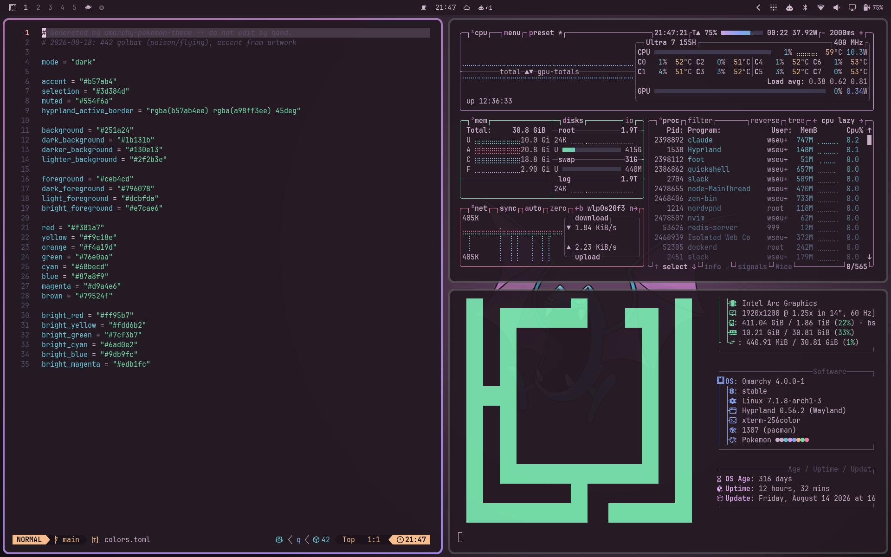
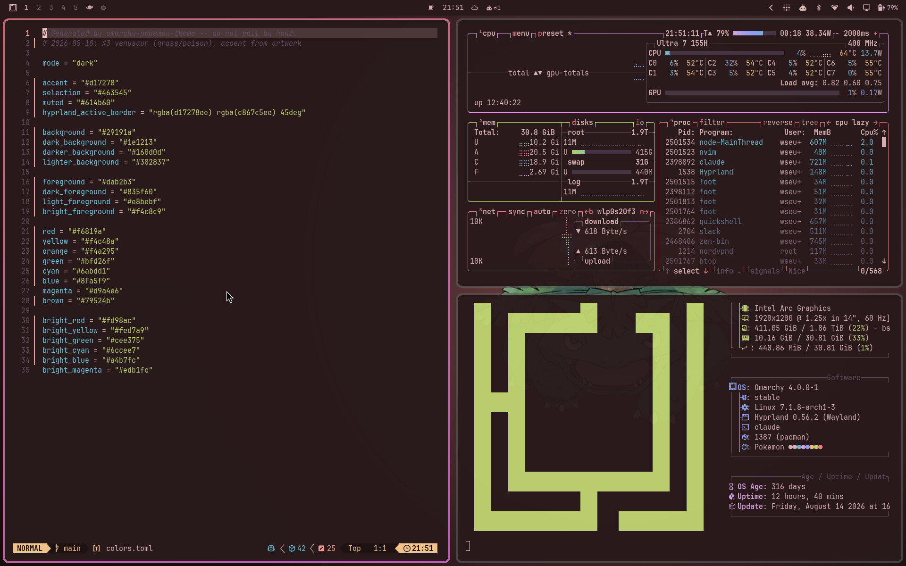
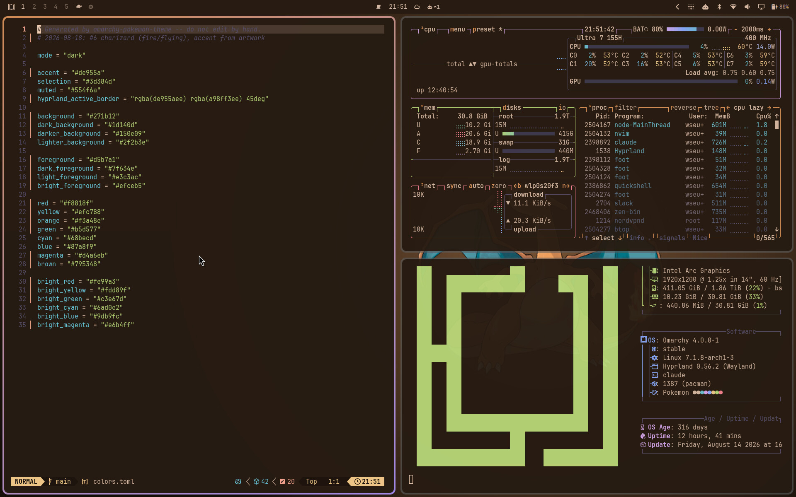
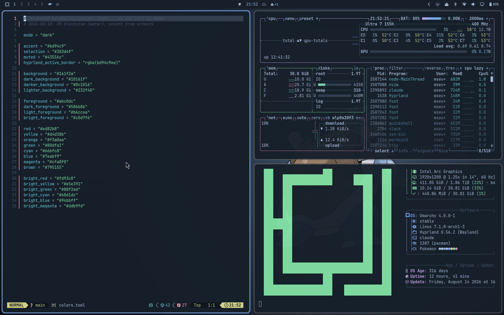

# Pokémon Theme

> **Disclaimer:** vibe-coded for my own machine. Personal use, no support,
> no guarantees - read the code before you run it.

An [Omarchy](https://omarchy.org/) 4 theme that picks a different Pokémon every
day. Its **own artwork** sets the palette, the whole desktop retints to match,
and that artwork becomes the wallpaper. Every couple of weeks, it shows up
shiny.


Companion to [omarchy-lock-pokemon](https://github.com/WSeubring/omarchy-lock-pokemon),
which does the same thing to the lock screen: with both installed, unlocking
shows the Pokémon already on the desktop.

## What changes

Omarchy generates seventeen config files from a theme's `colors.toml`, so one
palette carries all the way out to the edges:

| | |
| --- | --- |
| Terminals | alacritty, foot, kitty, ghostty |
| Editors | neovim, helix, vscode, obsidian |
| Shell & tools | the Omarchy bar, btop, gum, chromium |
| Agents | claude, pi |
| System | hyprland borders, keyboard backlight, icon theme |
| Chat | Vesktop / Vencord (Discord), if installed |

The colours come from the creature's own artwork: Charizard's orange belly,
Lapras's specific blue, Umbreon's yellow rings. Dual types show up too, as a
two-stop border gradient and a second layer of ambient motion.



The same desktop on a Venusaur, Charizard and Blastoise day:





## Install

```bash
omarchy theme install https://github.com/WSeubring/omarchy-pokemon-theme
~/.config/omarchy/themes/pokemon/install.sh
```

The installer opens a setup page in your browser: the real rendered wallpaper
and a live terminal mockup, repainted as you choose — pick a colour scheme and
intensity by looking at the actual desktop they produce, try any of the 905 as
a preview, and pin one as your starter if it clicks. No browser available, and
it falls back to a full-terminal wizard, then to plain prompts; all three ask
the same things. Re-running it is safe: it opens on whatever is already
installed and configured, and finishes with a checklist of what is in place.

It also offers the extras:

- **Animated particles**: the day's types drive subtle motion behind the
  wallpaper. Embers for a fire type, drifting flakes for ice, wisps for a
  ghost.
- **Pokémon picker**: a Pokémon section in the omarchy menu, shown only while
  this theme is active.
- **Lock screen**: the day's creature on the lock card, via the companion
  [omarchy-lock-pokemon](https://github.com/WSeubring/omarchy-lock-pokemon).
- **Terminal greeting** (off by default): a Pokédex entry in new terminals,
  via [pokedex-greeting](https://github.com/WSeubring/pokedex-greeting).

Flags (`--mode=…`, `--intensity=…`, `--pokemon=… [--pin]`, `--no-animation`,
`--no-menu`, `--no-lock`, `--no-greeting`, `--defaults`) or a non-interactive
run skip the questions. What this repo installed, `./uninstall.sh` removes;
the two companions are their own repos and uninstall separately.

The theme rolls itself at midnight, catches up after sleep, and regenerates
whenever you switch to it, so you never land on a stale day.

### Discord (Vesktop / Vencord)

Omarchy doesn't know about Discord, so the generator handles it directly: if
it finds a Vesktop (native or Flatpak) or Vencord install, it writes a
`pokemon.css` theme into the client's themes folder on every roll and enables
it in the client's settings. Vencord hot-reloads the file, so the day's
palette lands live; nothing to copy or toggle by hand, and no files are
written if no client is installed. One caveat: a client that is *running*
during the very first generation saves its own settings on quit, so the
enable takes effect on its next launch (or toggle it once under
**Settings > Vencord > Themes**).

## Picking a Pokémon

From the omarchy menu, under **Pokémon**:

```
Pokémon…
   Pick for today     search all 905; reverts at midnight
   Random for today   surprise me; reverts at midnight
   Pin permanently    keep one until you unpin it
   Back to daily ✓    drop any pin and use the day's own Pokémon
```

Or from the command line:

```bash
bin/pokemon-theme-gen --pokemon gengar   # just for today
bin/pokemon-theme-gen --random           # a random one, just for today
bin/pokemon-theme-gen --pin lapras       # permanently
bin/pokemon-theme-gen --unpin            # back to the daily roll
```

The generator always prints what it chose and why:

```
$ bin/pokemon-theme-gen
2026-08-18  #131 lapras (water/ice)  accent #6390f0  [pinned in config]
```

## Shiny

Every day rolls for shiny at **1 in 14**, about once a fortnight. A shiny day
is obvious from across the room: the shiny artwork's colours theme the whole
desktop (shiny Charizard means black-and-red, not orange), sparkles ring the
creature on the wallpaper, gold twinkles join the ambient motion, and the lock
screen fires its own sparkle animation.

Rerolling is how you hunt one: `--random`, or "Random for today" in the menu.
A shiny that turns up sticks for the rest of the day. `--shiny` forces one,
`--no-shiny` forces it back.

## Light mode

The palette has a light counterpart — not the dark ladder flipped, but its own
pastel ground that still carries the day's hue, solved so every one of the 905
days stays readable. Four ways to run it, in
`~/.config/omarchy-pokemon-theme/config.toml`:

```toml
mode = "dark"      # the default
mode = "light"
mode = "auto"      # light 08:00-20:00, dark at night (own flip times below)
mode = "pokemon"   # the day's creature decides: bright ones (Pikachu, Mew)
                   # get the light theme, everything else stays dark
```

Auto mode flips the whole desktop at the boundaries — wallpaper, terminals,
Discord, Claude Code, everything — via a systemd timer, and catches up after
sleep. One-off override: `bin/pokemon-theme-gen --mode light`.

## Configuration

Yours to edit, in `~/.config/omarchy-pokemon-theme/config.toml`:

```toml
pokemon = "lapras"    # pin one permanently; remove the line (or --unpin) to stop
shiny-odds = 14       # 1 in N per day; 4096 for canonical full odds
mode = "auto"         # dark / light / auto / pokemon, see above
light-from = "08:00"  # auto mode: when the light theme takes over
dark-from = "20:00"   # auto mode: when the dark theme returns
intensity = 1.0       # colour intensity, 0.4 (near-mono) to 1.6 (saturated);
                      # chroma only, so readability is untouched
```

Per-key overrides in `~/.config/omarchy/shell.toml` win over anything the
theme writes:

```toml
[background]
effects            = "hide"    # ambient motion off, plugin still installed
effect-intensity   = 1.0      # default is 0.55
pause-on-battery   = "never"  # default pauses when discharging below 30%
pause-when-covered = "false"  # default pauses when windows cover the desktop

[lock]
pokemon-name = ""             # lock screen rolls its own Pokémon again
```

Ambient motion pauses on its own when nobody can see it: whenever windows
cover the desktop, and on low battery. See
[plugins/background/README.md](plugins/background/README.md) for every token.

## More

How the palette is built, why all 905 days stay readable, the test suite, and
the repository layout: [docs/internals.md](docs/internals.md).

## Credits

Artwork and type data from [PokéAPI](https://pokeapi.co/). Type colours are the
long-standing community palette. Theming machinery from
[Omarchy](https://omarchy.org/). Discord token mapping vendored from
[base16-discord](https://github.com/imbypass/base16-Discord) (MIT).
MIT licensed.
